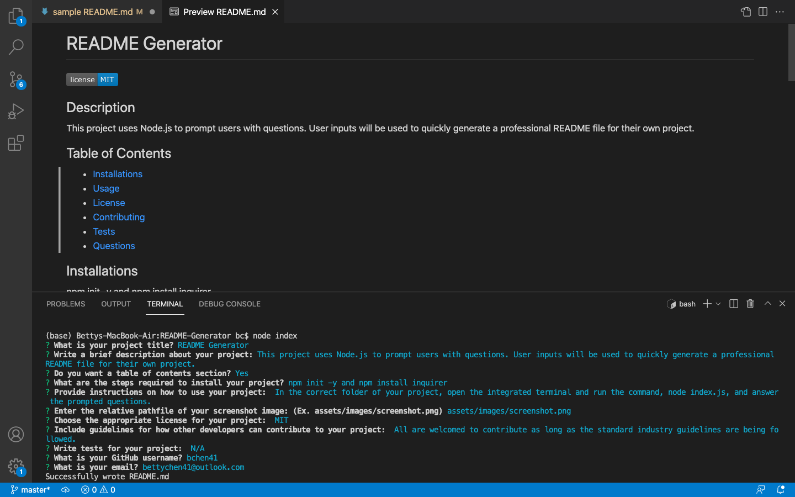

# README Generator

 

## Description

This project uses Node.js to prompt users with questions. User inputs will be used to quickly generate a professional README file for their own project.

## Table of Contents

- [Installations](#installations)
- [Usage](#usage)
- [License](#license)
- [Contributing](#contributing)
- [Tests](#tests)
- [Questions](#questions)

## Installations

npm init -y

npm install inquirer

## Usage

In the correct folder of your project, open the integrated terminal and run the command, node index.js, and answer the prompted questions.

### Screenshot of Project

  

### GIF of Project

### Video Link of Project

Click [here](https://drive.google.com/file/d/1u64gP5-1TfEZme_9gz3TGqRt3rufmpyI/view)!

## License

 
This application is covered by the MIT license.
 
Click [here](https://opensource.org/licenses/MIT) for the license link.

## Contributing

All are welcomed to contribute as long as the standard industry guidelines are being followed.
 
Click [here](https://www.contributor-covenant.org/) for industry standard guidelines.

## Tests

N/A

## Questions

Contact Me
 
Link to my [GitHub](https://github.com/bchen41) profile.
 
Reach me at my [email](mailto:bettychen41@outlook.com) for additional questions!

Author: Betty Chen
