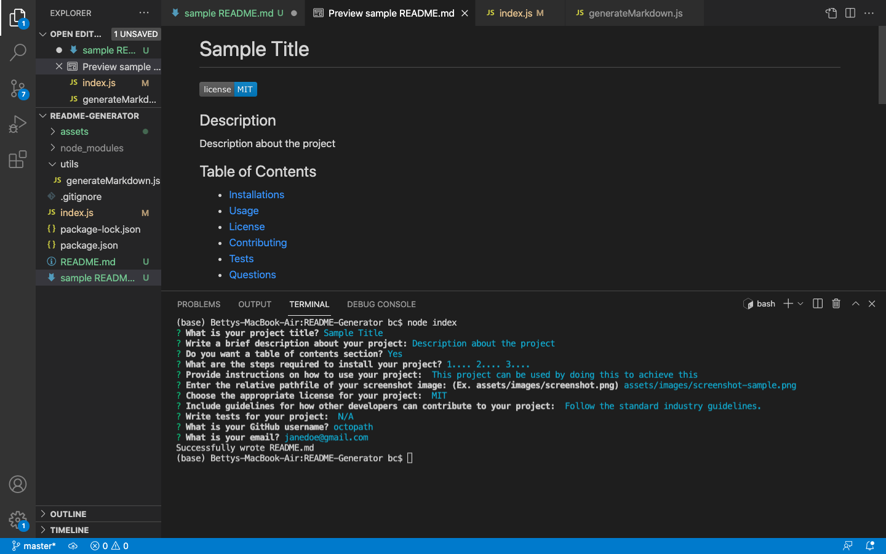

# Sample Title

 

## Description

Description about the project

## Table of Contents

- [Installations](#installations)
- [Usage](#usage)
- [License](#license)
- [Contributing](#contributing)
- [Tests](#tests)
- [Questions](#questions)

## Installations

1.... 2.... 3....

## Usage

This project can be used by doing this to achieve this

  

## License

 
This application is covered by the MIT license.
https://opensource.org/licenses/MIT

## Contributing

Follow the standard industry guidelines.
 
Click [here](https://www.contributor-covenant.org/) for industry standard guidelines.

## Tests

N/A

## Questions

Contact Me
 
Link to my [GitHub](https://github.com/octopath) profile.
 
Reach me at my [email](mailto:janedoe@gmail.com) for additional questions!
