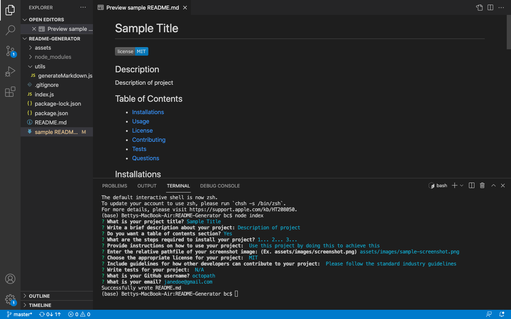

# Sample Title

 

## Description

Description of project

## Table of Contents

- [Installations](#installations)
- [Usage](#usage)
- [License](#license)
- [Contributing](#contributing)
- [Tests](#tests)
- [Questions](#questions)

## Installations

1... 2... 3...

## Usage

Use the project by doing this to achieve this
 

### Screenshot of Project

   
  

## License

 
This application is covered by the MIT license.
 
Click [here](https://opensource.org/licenses/MIT) to be directed to the license link.

## Contributing

Follow the standard industry guidelines
 
Click [here](https://www.contributor-covenant.org/) for industry standard guidelines.

## Tests

N/A

## Questions

Contact Me
 
Link to my [GitHub](https://github.com/octopath) profile.
 
Reach me at my [email](mailto:janedoe@gmail.com) for additional questions!
